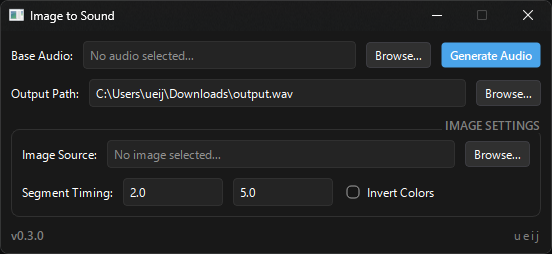
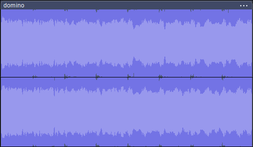
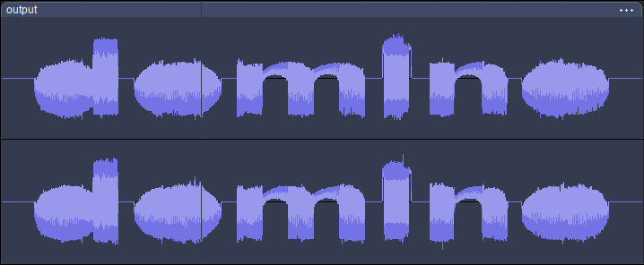

# Image to Sound (v0.3.0)

A desktop utility that modulates the amplitude of an existing audio file using the top and bottom boundaries of an image.

> **Note:** The GUI (v0.3.0) is pretty simple right now because I'm still learning (づ_ど); while the underlying Python engine supports even more advanced settings (like custom image resolutions and specific grayscale filters), the GUI uses sensible defaults for quick single-image audio modulation.



## Features Available in the GUI
* **Base Audio Selection:** Works with `.mp3`, `.ogg`, and `.wav` files.
* **Custom Output Path:** Browse and select where to save your generated audio file and choose your own filename.
* **Image Source Selection:** Supports `.jpg`, `.jpeg`, `.png`, and `.webp` images.
* **Segment Timing:** Choose exactly when (in seconds) the image modulation starts and ends within your base audio.
* **Invert Colors:** Toggle color inversion directly in the GUI to easily process light shapes on dark backgrounds.
* **Stereo Processing:** Generates a 24-bit stereo `.wav` file with the modulation applied to your selected segment.

## How to Use the Windows App (.exe)

1. Go to the **Releases** tab on the right side of this GitHub repository.
2. Download `image-to-sound-v0.3.0-windows-x64.exe`.
3. Run the executable.
4. **Select Base Audio:** Click "Browse..." and select your base audio track.
5. **Set Output Path:** The default is set to save as `output.wav` in the directory where the application is running, but you can click "Browse..." to change the destination and name.
6. **Select Image Source:** Click "Browse..." and select the image you want to extract contours from.
7. **Set Segment Timing:** Input the start time and end time (in seconds) where you want the visual shape to affect the audio.
8. **Invert Colors (Optional):** Check the "Invert Colors" box if your image has a light shape on a dark background.
9. **Generate:** Click **Generate Audio**.

> [!IMPORTANT]
> The processing engine tracks **black pixels** to define the shape and discards white pixels as empty space. If your source image features a white shape/text on a black background, make sure the **Invert Colors** checkbox is checked.

*The GUI currently applies a binarization threshold of 128, a standard luminance grayscale filter (ITU-R BT.601 Luma), and mirrors the images per stereo channel.*

## Preview and Examples

Below is an example of how the text silhouette 'domino' is modulated on an audio track.

### Image Previews

<table>
  <tr>
    <th width="33.33%">Source Image</th>
    <th width="33.33%">Base Audio</th>
    <th width="33.33%">Output</th>
  </tr>
  <tr>
    <td>
       
       <p align="center">'domino' text</p>
    </td>
    <td>
       
       <p align="center">The original track's waveforms</p>
    </td>
    <td>
       
       <p align="center">The word 'domino' visible on waveforms</p>
    </td>
  </tr>
</table>

### Audio Comparison

You can download and listen to how the shape of the text squeezes and shapes the volume of the track:

* **Original Base Audio:** 
  [Listen to domino.wav](audios/audio_domino.wav)
* **Modulated Output:** 
  [Listen to output.wav](audios/audio_output.wav)

## Running from Source (Advanced Users)

If you want to use the full feature set (such as independent stereo channels, custom image resolutions, or manual threshold adjustments), you can run the command-line interface (`main.py`) directly using Python.

### Prerequisites
Make sure you have Python 3.10+ installed. Install the dependencies:
```bash
pip install PySide6 pillow numpy soundfile