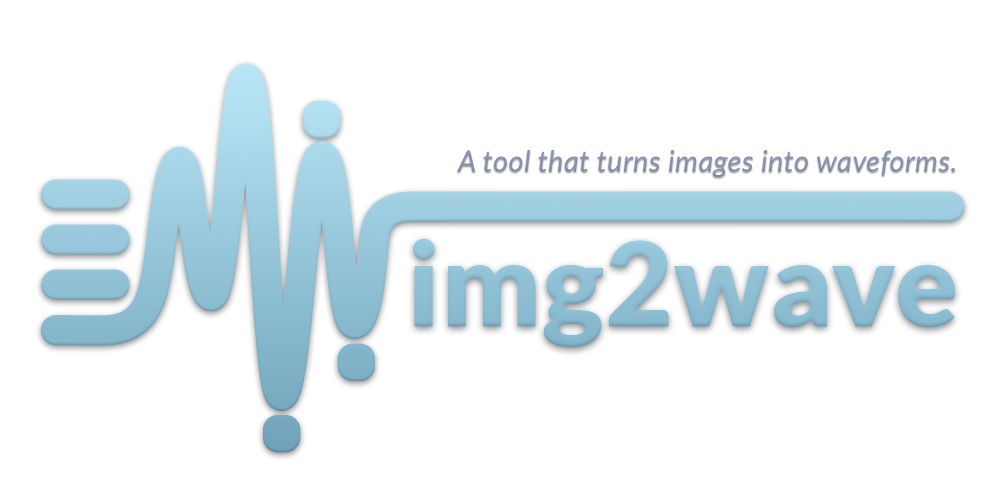
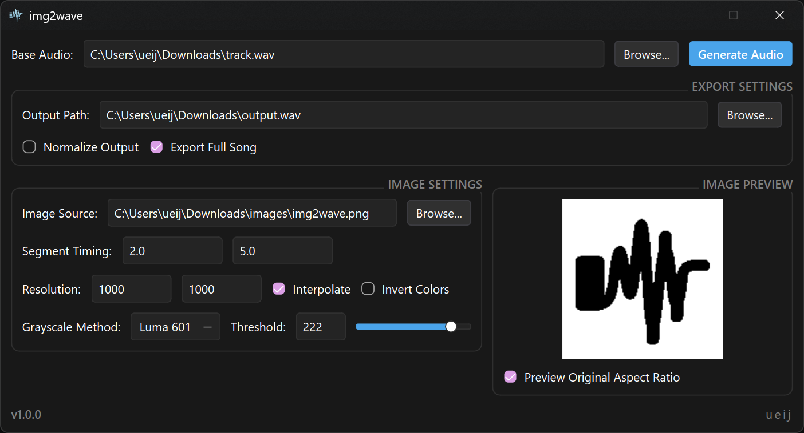

# img2wave (v1.0.0)



**img2wave** is a desktop utility that modulates the amplitude of an existing audio file using the top and bottom boundaries of an image.

> *Thanks to* ***kyrup*** *for instigating the question for how to turn images to waveforms, and to [Japhy Riddle's YouTube video](https://www.youtube.com/watch?v=qeUAHHPt-LY) for the concept and overall idea.* (づ_ど)



## Features Available in the GUI

* **Base Audio & Output Path:** Work with common audio files like `.mp3`, `.ogg`, and `.wav` files. Customize your output directory and filename.
* **Segment Timing:** Choose exactly when (in seconds) the image modulation starts and ends within your audio track.
* **Resolution** Manually define the processing width and height of the image analysis (larger dimensions provide finer boundary details).
* **Interpolate:** Toggle between smooth linear interpolation and blocky nearest-neighbor interpolation.
* **Invert Colors:** Instantly swap dark and light spaces to process light shapes on dark backgrounds.
* **Dynamic Threshold Control:** Use the slider or text input (0–255) to quickly dial in the binarization threshold.
* **Grayscale Methods:** Choose from Luma 601, Luma 709, Average, or Lightness algorithms to handle color-to-grayscale conversion.
* **Export Settings:**
  * **Export Full Song:** Toggle between exporting the entire base audio track (with the modulated portion mixed in) or just the isolated modulated segment.
  * **Normalize Output:** Force-normalize the output wave's peak amplitude to exactly 0 dBFS.
* **Image Preview:** A real-time visual panel displaying a binarized, filled-in representation of how your current settings affect the image envelope.

## How to Use the Windows App (.exe)

1. Go to the **Releases** tab on the right side of this GitHub repository.
2. Download `img2wave-v1.0.0-windows-x64.exe`.
3. Run the executable.
4. **Select Base Audio:** Click "Browse..." and select your base audio track.
5. **Select Image Source:** Click "Browse..." and select the image you want to extract contours from.
6. **Set Segment Timing:** Input the start time and end time (in seconds) where you want the visual shape to modulate the audio.
7. **Generate:** Click **Generate Audio**.

> [!IMPORTANT]
> The processing engine tracks **black pixels** to define the boundaries of the shape and discards white pixels as empty space. If your source image features a white shape/text on a dark background, make sure the **Invert Colors** checkbox is checked.

## Preview and Examples

Below is an example of how the text silhouette 'domino' is modulated on an audio track.

### Image Previews

<table>
  <tr>
    <th width="33.33%">Source Image</th>
    <th width="33.33%">Base Audio</th>
    <th width="33.33%">Output</th>
  </tr>
  <tr>
    <td>
       
       <p align="center">'domino' text</p>
    </td>
    <td>
       
       <p align="center">The original track's waveforms</p>
    </td>
    <td>
       
       <p align="center">The word 'domino' visible on waveforms</p>
    </td>
  </tr>
</table>

### Audio Comparison

You can download and listen to how the shape of the text squeezes and shapes the volume of the track:

* **Original Base Audio:** 
  [Download](https://github.com/ueij/img2wave/raw/refs/heads/main/audios/domino_base.wav)
* **Modulated Output:** 
  [Download](https://github.com/ueij/img2wave/raw/refs/heads/main/audios/domino_modulated.wav)

## Running from Source (Command-Line Interface)

If you prefer to bypass the graphical interface and run the tool directly from your terminal, you can interact with `main.py`.

### Prerequisites
Make sure you have Python 3.10+ installed. Install the dependencies:
```bash
pip install PySide6 pillow numpy soundfile
```

### CLI Usage & Arguments
Run the script by providing the required audio and image inputs:
```bash
python main.py --audio "my_audio.wav" --image "my_image.png" --start 2.0 --end 5.0
```

#### Available CLI Arguments:
* `--audio <path>` (Required): Path to the base audio file.
* `--image <path>` (Required): Path to the image file.
* `--output <path>` (Default: `output.wav`): Path to save the generated WAV file.
* `--start <float>` (Default: `2.0`): Segment start time in seconds.
* `--end <float>` (Default: `5.0`): Segment end time in seconds.
* `--threshold <int>` (Default: `128`): Binarization threshold value (0–255).
* `--grayscale <method>` (Default: `luminance_601`): Grayscale algorithm choice: `luminance_601`, `luminance_709`, `average`, or `lightness`.
* `--invert`: Flag to invert image colors.
* `--width <int>` (Default: `2048`): Analysis resolution width.
* `--height <int>` (Default: `512`): Analysis resolution height.
* `--smooth / --no-smooth` (Default: `--smooth`): Use linear interpolation or blocky, step-based interpolation.
* `--normalize`: Flag to normalize output peak levels to 0 dBFS.
* `--export-full / --no-export-full` (Default: `--export-full`): Export the full song length or only the modulated segment.
* `--debug`: Flag to export debug binarized and filled-in PNG images of the analysis process.